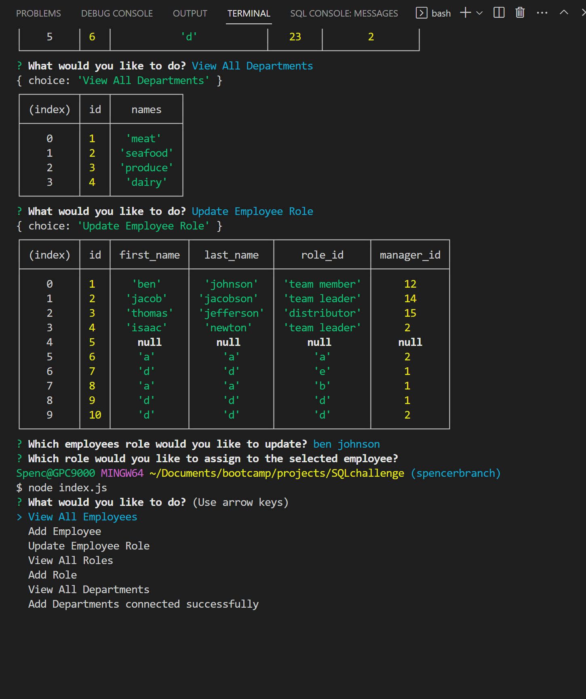
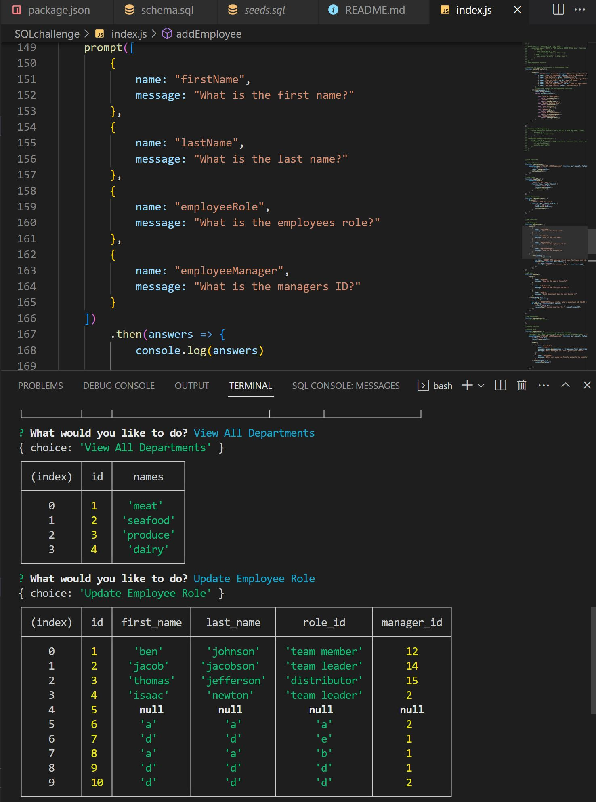

# <employee-tracker>

## Description

track your employees using this command line application. 
## Table of Contents (Optional)

N/A

## Installation

Run using the terminal

## Usage

Simply run node index.js and follow the propts to add, view, or update.

## Credits

N/A

## License

MIT

## Badges

N/A

## Features

N/A

## How to Contribute

N/A

## Tests
N/A

## Screenshots

## Link to Live Site
N/A
